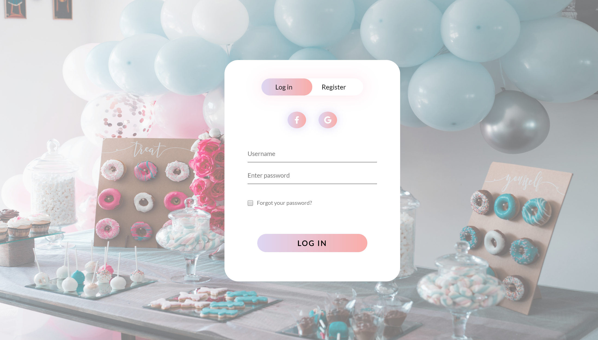
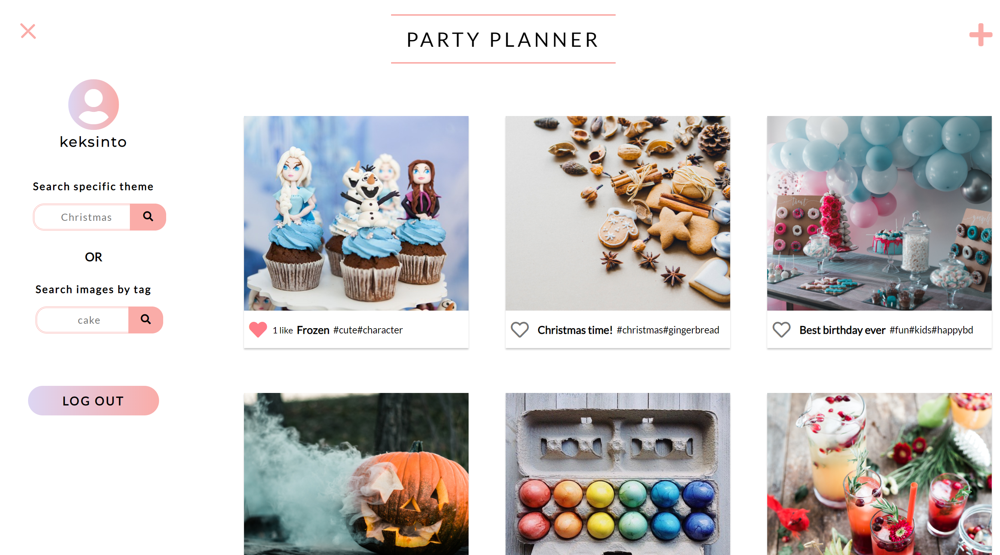
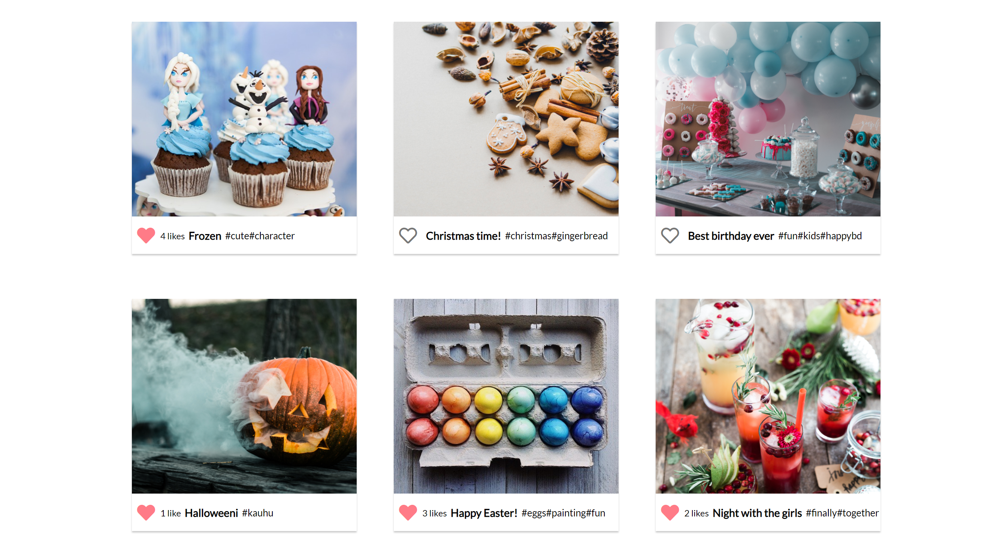
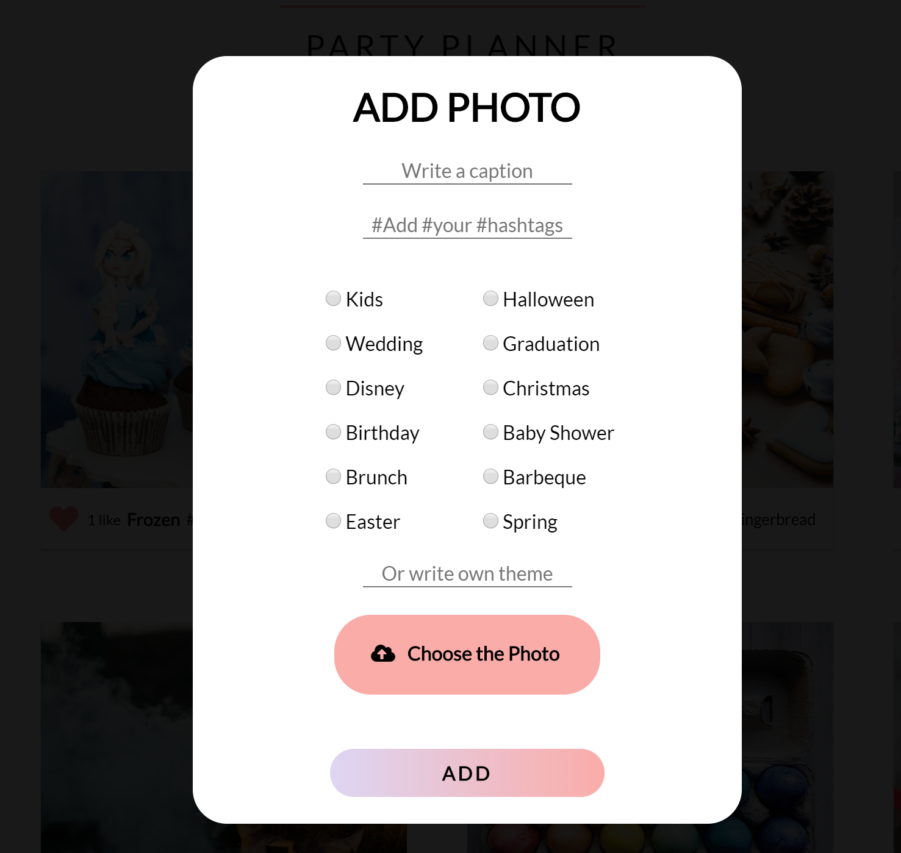
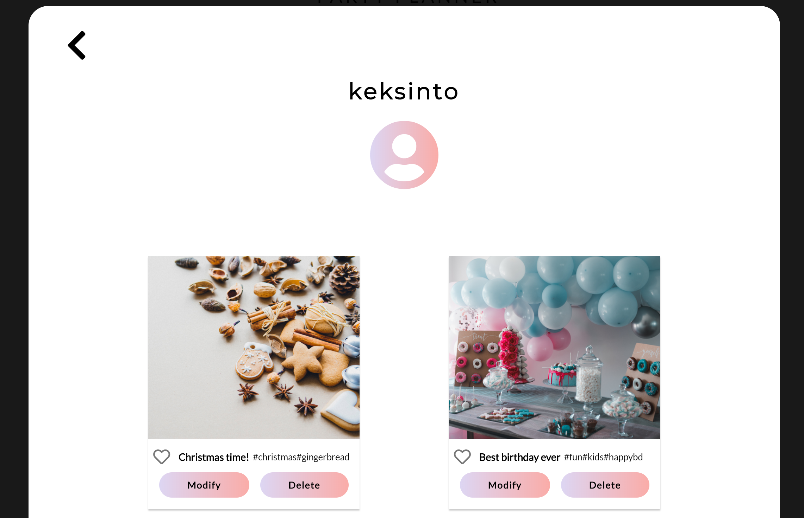

<h1>PartyPlannerApp</h1>

Media sharing app where you can as a registered user add own posts and like and search others posts. 
Inspiration for the app came from Instagram and Pinterest, where user can search photos they like.

First user has to sign up/log in. In the frontpage user can see the latest posts. At the navigation user can search posts by tagname or a theme name. Example a mother wants to throw a Frozen-themed birthday party for her daughter -> just search "frozen". 
At "Mypage" user can modify and delete their own posts. User can also like and dislike photos.

Used techniques:
- Node.js, Express.js 
- JavaScript
- CSS/SCSS
- HTML
- SQL + PhpMyAdmin

<h3>LogIn/Registration</h3>

<h3>Mainview/Sidenavigation</h3>

<h3>Likes</h3>

<h3>Add-form</h3>

<h3>Mypage</h3>

Started as school project that was made in pairs and has been upgraded since. 
